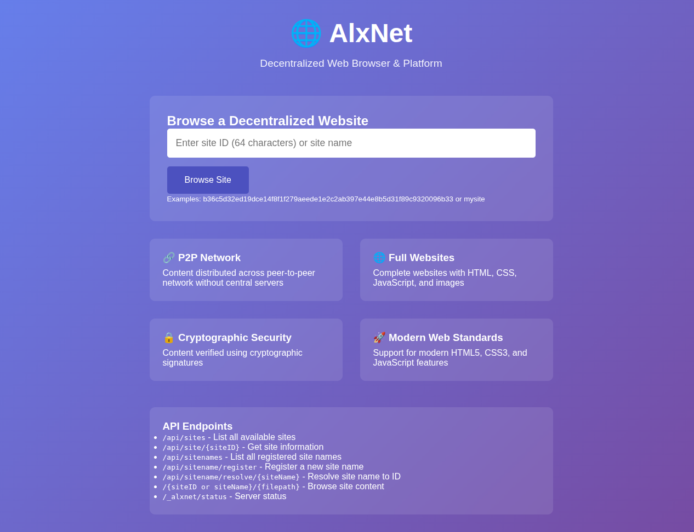
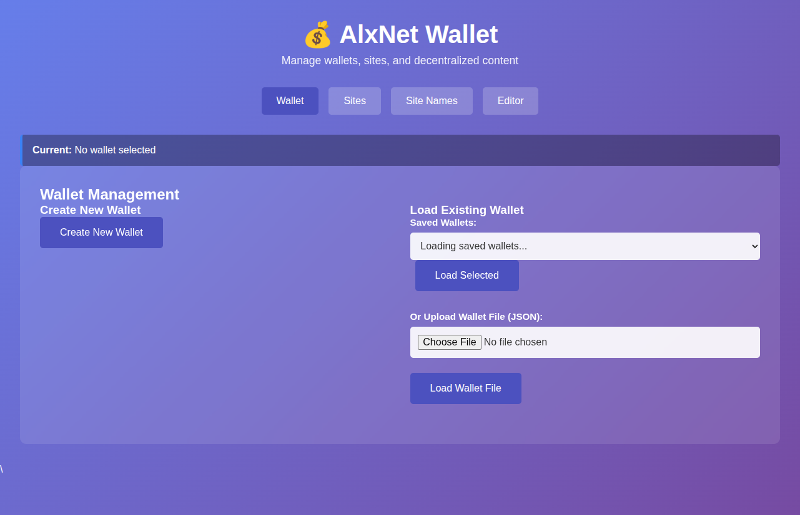
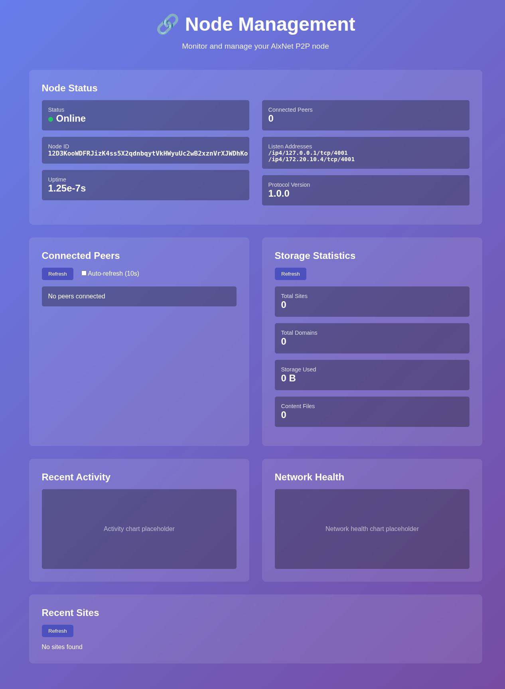

<div align="center">

# 🌐 AlxNet

Decentralized multi‑file website publishing & browsing in one self‑contained Go binary.

[](go.mod)
[](./security-audit.sh)
[](#tests)

</div>

---

## ✨ What Is AlxNet?
AlxNet is a peer‑to‑peer platform that lets you:

* Create cryptographically owned “sites” from a mnemonic wallet (BIP‑39)
* Publish either a single HTML document or a full multi‑file website (HTML/CSS/JS/images/etc.)
* Distribute and fetch content over a libp2p GossipSub network with local mDNS discovery
* Browse published sites through an integrated browser UI
* Manage keys, sites, files, domains (human‑readable site names), and publishing through a wallet UI
* Observe node peers, storage, and health via a node dashboard UI

Everything runs locally with: `./bin/alxnet start`.

---

## 🧩 Architecture Overview

| Layer | Component | Source | Key Responsibilities |
|-------|-----------|--------|----------------------|
| CLI | `cmd/alxnet/main.go` | Startup orchestration, flag parsing, service lifecycle |
| P2P Core | `internal/p2p` | libp2p host, GossipSub topic (`alxnet/updates/v1`), browse protocol, peer management, rate limiting scaffolding |
| Data Store | `internal/store` | BadgerDB persistence, records, content blobs, multi‑file website manifests, domain (site name) registry |
| Crypto Model | `internal/core`, `internal/crypto`, `internal/wallet` | Canonical CBOR record/manifest/file structures, Ed25519 signatures, deterministic site key derivation, CID generation (SHA‑256) |
| Web UIs | `internal/webserver` | Browser UI, Wallet UI, Node UI (three HTTP servers) |
| Networking Add‑ons | mDNS + bootstrap support | Local peer discovery, manual bootstrap addressing |

Content objects are addressed by SHA‑256 (hex) and linked through signed UpdateRecords / WebsiteManifests. Each update is a two‑stage signature: long‑term site key signs the link (link preimage) and an ephemeral update key signs the canonical CBOR body.

---

## 🚀 Quick Start

### 1. Clone & Build
```bash
git clone https://github.com/alxspiker/AlxNet.git
cd AlxNet
go mod tidy          # downloads dependencies (first run ~12s)
./build.sh           # full build: tests + lint + hardened binary
```

Result: hardened binary at `./bin/alxnet`.

### 2. Run the Platform
```bash
./bin/alxnet start
```

Default ports:
* Browser UI: http://localhost:8080
* Wallet UI:  http://localhost:8081
* Node UI:    http://localhost:8082
* P2P listen: dynamically chosen (unless `-node-port` provided)

### 3. Publish & Browse (High Level)
1. Open the Wallet UI (8081)
2. Create a new wallet (derive mnemonic + deterministic site keys)
3. Create a site label (e.g. `mysite`)
4. Add files (e.g. `index.html`, `style.css`, `script.js`, images)
5. Publish website (wallet assembles FileRecords + Manifest, signs, stores locally, broadcasts)
6. Browse at Browser UI: `http://localhost:8080/mysite` (resolved via domain registry) or by raw 64‑char SiteID

---

## 🔑 Wallet & Site Model

| Concept | Description |
|---------|-------------|
| Wallet | JSON structure containing multiple site entries (labels → SiteMeta) plus timestamps. Can be encrypted using mnemonic (argon2id + XChaCha20‑Poly1305) for persistence. |
| Mnemonic | BIP‑39 phrase → HKDF master key → deterministic site keys per label. |
| Site | A pair of keys (long‑term Site key + per‑update ephemeral key) representing ownership of a content chain. SiteID = SHA‑256(site public key). |
| UpdateRecord | For legacy single‑file flow: links old record to new content CID with sequence increment. |
| WebsiteManifest | For multi‑file websites: maps relative paths to content CIDs, includes main entry file path. |
| FileRecord | Metadata for each file (path, MIME type, contentCID, signatures, timestamp). Stored separately for introspection/tooling. |

Deterministic derivation lets you recover all site keys from only the mnemonic and labels.

---

## 🗂️ Storage Layout (BadgerDB Keys)

| Prefix | Purpose |
|--------|---------|
| `record:<cid>` | Stored UpdateRecord CBOR bytes |
| `content:<cid>` | Raw file/content bytes |
| `site:<siteID>:head:<seq>` | Current head pointer (single‑file legacy) |
| `manifest:<cid>` | WebsiteManifest CBOR bytes |
| `site:<siteID>:manifest` | Pointer to current manifest CID |
| `filerecord:<cid>` | FileRecord CBOR bytes (per path) |
| `site:<siteID>:file:<path>` | Path → FileRecord CID mapping |
| `domain:<name>` | Human‑readable site name → SiteID |

Resolution helpers allow prefix lookups for content and record CIDs.

---

## 🌐 Web Interfaces

### Browser UI (port 8080)
Endpoints:
* `/` homepage & site navigation helper
* `/{siteID|name}/[file]` serve content (manifest aware)
* `/api/sites` list discovered sites (local store)
* `/api/site/{siteID}` website info (manifest metadata)
* `/api/sitenames` list registered site names
* `/api/sitename/register` POST register name → SiteID
* `/api/sitename/resolve/{name}` resolve name
* `/_alxnet/status` basic status JSON

### Wallet UI (port 8081)
Major endpoints (selected):
* `/api/wallet/new`, `/api/wallet/load`, `/api/wallet/save`
* `/api/wallet/sites` list sites in wallet
* `/api/wallet/add-site` create site label & keypair
* `/api/wallet/add-file` add/modify a file in working set
* `/api/wallet/publish-website` generate manifest + records + broadcast
* `/api/site/save-file` persist a file record
* `/api/site/files` list files for a site
* `/api/domains/register` register site name
* `/api/domains/list` list all registered names

### Node UI (port 8082)
Endpoints:
* `/api/node/status` basic node info (ID, etc.)
* `/api/node/peers` connected peers list
* `/api/storage/stats` aggregate storage usage
* `/api/storage/sites` site enumeration
* `/api/storage/domains` domain registry snapshot
* `/api/network/bootstrap` future bootstrap management (scaffold)

---

## 🛰️ P2P Protocols

| Aspect | Implementation |
|--------|----------------|
| Gossip Topic | `alxnet/updates/v1` (CBOR‑encoded GossipUpdate / GossipDelete) |
| Browse Protocol | `/alxnet/browse/1.0.0` request/response (get_head, get_content) |
| Discovery | mDNS (`alxnet-mdns`) + optional manual multiaddr bootstrap |
| Integrity | Ed25519 signatures + SHA‑256 CIDs + canonical CBOR |
| Rate Limiting | In‑memory sliding window scaffolding (per peer) |

Browse protocol enables selective fetching: HEAD info then specific content chunks by CID.

---

## 🔐 Security Mechanics (Implemented)

* Ed25519 signing for UpdateRecord, Manifest, FileRecord chain of trust
* Dual signature (site key + ephemeral per update key)
* Canonical CBOR deterministic serialization for signature stability
* Content addressing (SHA‑256) prevents tampering
* Input validation: sizes, path constraints, allowed extensions, identifier formats
* Domain (site name) validation: pattern + uniqueness
* Wallet encryption: Argon2id KDF (configurable params) + XChaCha20‑Poly1305 AEAD
* Basic rate limiting + peer reputation scaffolding in `p2p.Node`

Planned / TODO areas are annotated with `TODO:` comments in code (e.g., content cleanup policy, domain transfer cryptographic proof, more robust peer validation scoring, localhost discovery helper).

---

## ⚙️ CLI Usage

```text
./bin/alxnet start [options]

Options:
  -data ./data            Data directory (creates if missing)
  -node-port 4001         P2P listen port (0 = auto assign)
  -browser-port 8080      Browser interface HTTP port
  -wallet-port 8081       Wallet management HTTP port
  -node-ui-port 8082      Node management HTTP port
  -bootstrap <multiaddr>  Optional bootstrap peer multiaddr

Examples:
  ./bin/alxnet start
  ./bin/alxnet start -node-port 4001
  ./bin/alxnet start -browser-port 8085 -wallet-port 8086 -node-ui-port 8087
  ./bin/alxnet start -bootstrap /ip4/127.0.0.1/tcp/4001/p2p/<peerID>
```

---

## 🧪 Development & Validation

Recommended full cycle:
```bash
go mod tidy
go test -v ./...
./build.sh
./bin/alxnet start
# visit UIs → CTRL+C to stop
./security-audit.sh
```

Partial / faster iteration:
```bash
go test -v ./internal/core
go build -o bin/alxnet cmd/alxnet/main.go
```

### Tests
Current test coverage focuses on core type validation (`internal/core/types_test.go`). Extend with:
* Store persistence edge cases
* Manifest publishing round‑trip
* P2P browse protocol request/response

### Security Audit Script
`./security-audit.sh` runs `go vet`, `staticcheck`, `golangci-lint`, `gosec`, `govulncheck` (where configured) and stores reports under `security-audit/`.

---

## 🗺️ Multi‑Node Example

Terminal 1:
```bash
./bin/alxnet start -node-port 4001 -data ./data-node1
```
Take note of printed multiaddrs (include peer ID).

Terminal 2:
```bash
./bin/alxnet start -node-port 4002 -data ./data-node2 -bootstrap /ip4/127.0.0.1/tcp/4001/p2p/<peerID>
```

Node UI (8082 for each) will display peer connections once gossip establishes.

---

## 📦 Data & Content Limits

| Limit | Value |
|-------|-------|
| Max single content blob | 10 MB (`core.MaxContentSize`) |
| Max website files | 1000 |
| Max record size | 1 MB |
| Max site names length | 32 chars (validation rules in `store`) |
| Max stored content size (enforced per object) | 100 MB (Store value limit) |

Exceeding constraints returns validation errors before persistence.

---

## 🛠️ Troubleshooting

| Symptom | Likely Cause | Fix |
|---------|--------------|-----|
| Build fails | Missing Go 1.23+ | Install/update Go toolchain |
| Ports in use | Previous run not fully stopped | Kill stray process or change ports |
| No peers discovered | mDNS isolation / no other nodes | Start second node or use `-bootstrap` |
| Site name 409 conflict | Name already registered | Choose different name |
| Wallet decrypt error | Wrong mnemonic / corrupted file | Ensure correct phrase; keep backups |

Logs use zap (development or production modes depending on main). Check console for peer events and validation rejections.

---

## 🧭 Roadmap (Selected TODOs Visible in Code)
* Content LRU cleanup & memory bound enforcement (`p2p.Node.cleanupOldContent`)
* Domain transfer cryptographic flow (`store.TransferDomain`)
* Enhanced peer reputation scoring & ban logic
* Localhost active probing discovery helper
* Metrics & profiling exposure (config scaffolding exists)

---

## 🤝 Contributing
PRs welcome. Please:
1. Open an issue describing enhancement/bug.
2. Add focused tests where behavior changes.
3. Run full build + security audit before pushing.
4. Keep README / docs updated with observable behavior only.

Security concerns: open a private issue if sensitive.

---

## 📄 License
MIT (see `LICENSE` if present). If no license file yet, add MIT or desired license before redistribution.

---

## 💬 At A Glance
AlxNet delivers deterministic, signed, multi‑file site publishing over libp2p with an all‑in‑one operational UX (browser + wallet + node dashboards). Clone, build, start, publish—no external dependencies beyond Go & network sockets.

---

### UI Screenshots
| Browser UI | Wallet UI | Node UI |
|------------|-----------|---------|
|  |  |  |

Raw images live in `docs/assets/`.

---

Happy hacking!

